# Architecture

Mailbox Personal Assistant watches a Gmail inbox, triages every new email with a language model guided by long-term
memory, acts on some of them, and keeps a start-of-day Quick Overview. It runs as one Python process plus a React UI.

## Components



<sub>Source: [diagrams/components.mmd](diagrams/components.mmd)</sub>

## Process model

`uv run mail-assistant` starts four things in one process (`src/mail_assistant/__init__.py`):

| Thread | Module | Job |
| --- | --- | --- |
| Mail watcher | `mail_watcher/__new_mail_watcher__.py` | Blocks on IMAP IDLE; every new inbox message is downloaded and stored as `pending`. The cursor (`UIDVALIDITY:lastUID`) is saved after each message, so a restart resumes without repeating work. On a fresh start it backfills `MAIL_BACKFILL_DAYS` of inbox mail. |
| Triage cron | `cron_job/__triage_cron__.py` | Every `TRIAGE_INTERVAL_SECONDS`, runs the triage router on stored mail triage has not seen yet, oldest first, up to `TRIAGE_WORKERS` emails at a time, each worker with its own IMAP connection. |
| Report cron | `cron_job/__report_generation_cron__.py` | Builds the Quick Overview at startup and every `REPORT_INTERVAL_SECONDS`, writing `inbox_report.json`; the model is skipped when nothing changed since the last build. |
| API server | `api/__app__.py` on uvicorn | Serves `/api/*` and the built React UI. A PATCH from the Inbox tab runs the router with `source = "user"`; Rebuild runs the report agent; the Memory chat edits the learned rules by name. |

All of them share one OAuth token with the full-mail and calendar-events scopes (`gmail_client/auth.py`). Each thread opens
its own IMAP connection; connections that Gmail drops are reconnected once and the operation retried, and sockets have a
read timeout so a half-open connection cannot block a thread forever.

## Agents

There are three LangGraph graphs; their state graphs are in [state-graphs.md](state-graphs.md).

| Agent | Trigger | Model use | Writes |
| --- | --- | --- | --- |
| Email triage router | Each stored email, via the triage cron; each category saved by hand | One structured-output call in `triage`, skipped when `pre_triage` already decided | SQLite row, ignore-list entries, trace lines |
| Inbox manager | Router, for `auto_schedule` and `auto_draft` | A tool loop with only the category's tools | Calendar event or RSVP (`auto_schedule`), a Gmail draft (`auto_draft`), the email's `action`, a trace line |
| Inbox report | Cron and Rebuild | One structured call over a snapshot gathered by code; none when nothing changed | `inbox_report.json` |

Each agent has its own provider (`ollama`, `anthropic`, `openai`) and model, from the `TRIAGE_`, `MEMORY_CHAT_`,
`MANAGER_`, and `REPORT_` prefixed `LLM_PROVIDER` and `MODEL` settings. Every model call goes through
`agents/llm/__structured_llm__.py`.

## Long-term memory

Memory has three parts, all read by the router and the report agent and shown on the Memory tab:

- **Base rules** live in code (`db/__memory_store__.py`, `LONG_TERM_MEMORY`): named rules that only ever yield `ignore`
  or `notify`.
- **Learned rules** live in `long_term_memory.json` as `- name: rule` lines, edited through the Memory tab's chat, which
  has the model return named additions and removals that code merges into the list, so unmentioned rules never change.
  Learned rules win over base rules and are the only way to unlock a reply category.
- **The pre-triage ignore list** (`pre_triage_ignore_list.json`) holds ignored senders grouped by reason, each with
  who added it (the model, you, or unknown for older entries). It is filled by the model's own ignore decisions whose
  rule is about the sender, edited on the Memory tab, and checked by `pre_triage` after the reply and keep-list
  checks, so a listed sender never reaches the model. Gmail's Promotions, Social, and Forums tabs are not trusted as
  decisions: such mail goes to the model, and the list learns from what the model decides.
- **The keep list** (`pre_triage_keep_list.json`) holds addresses and domains that always reach the model, whatever
  the ignore list or any shortcut would say. Edited on the Memory tab under "Always triage".

## Categories and rules

| Category | Meaning | Who decides |
| --- | --- | --- |
| `ignore` | Not worth reading | `pre_triage` by your label, a muted thread, or the ignore list; the model by a base or learned rule; you, with the Ignore button. Never for a sender on the keep list |
| `notify` | Worth knowing, no reply | The model; also the default when it cannot decide. `pre_triage` for automated senders (no-reply, notification, alert, receipt addresses) that no learned rule names |
| `auto_schedule` | The assistant acts on the calendar: a reminder or an RSVP | The model, only with a learned rule that names the sender or kind of mail |
| `auto_draft` | The assistant drafts, the person reviews | The model, only with a learned rule |
| `user_reply_complete` | The person already replied | `pre_triage`; also set when you send a reply from the Inbox tab |
| `pending` | Stored, not yet triaged; or triage failed (reason says so) | The watcher on arrival; the router on any error |

Every stored email carries `applied_rule` (the rule name, `pre_triage`, `gmail_*`, `label_*`, `ignore_list_*`, `manual`,
or empty) and `action` (what the manager did). The Traces tab shows one line per graph step from `traces.jsonl`.

## Repository layout

```
python-backend/src/mail_assistant/
  __init__.py                    entry point: threads + uvicorn
  api/__app__.py                 FastAPI routes, serves react-frontend/dist
  agents/
    __email_triage_router_agent__.py
    __inbox_manager_agent__.py
    __inbox_report_agent__.py
    __memory_chat_agent__.py     Memory tab chat -> learned rules
    __feedback_agent__.py        Triage again: feedback -> keep/ignore lists, learned rule, re-triage
    llm/__structured_llm__.py    provider switch, structured output
    tools/__gmail_tools__.py     IMAP tools (read and write sets)
    tools/__calendar_tools__.py  Calendar API tools
    skills/*/SKILL.md            prompts for the manager and the report
  gmail_client/                  auth.py (OAuth), imap.py, calendar.py
  mail_watcher/                  IMAP IDLE watcher: stores new mail as pending
  cron_job/                      triage cron, report cron
  db/                            SQLite store, memory store, ignore-list store, trace store
  models/                        EmailMessage, Category, LongTermMemory, IgnoreEntry, TraceEntry
  config/__app_config__.py       the only module that reads .env
react-frontend/src/              App.jsx (tabs) and views/
docs/                            this folder
```
