# Data reference

Everything the app persists lives in `python-backend/` as files, all gitignored. Paths can be moved with the settings in
`.env` (see `.env.example`).

## Entities



<sub>Source: [diagrams/entities.mmd](diagrams/entities.mmd)</sub>

## Files

| File | Setting | Written by | Read by |
| --- | --- | --- | --- |
| `mail_assistant.db` | `MAIL_DB_FILE` | Router `save`, manager `handle`, API PATCH | Triage tab, Home panels, report recall |
| `long_term_memory.json` | `MEMORY_FILE` | Router `remember`, API PATCH, Memory chat | Router `recall`, report recall, manager recall, Memory tab |
| `traces.jsonl` | `TRACE_FILE` | Router steps, manager `handle` | Traces tab |
| `inbox_report.json` | `REPORT_FILE` | Report agent `generate` | Home tab |
| `.mail_check_state.json` | `MAIL_CHECK_STATE_FILE` | Watcher, after every message | Watcher at start |
| `token.json` | `GMAIL_TOKEN_FILE` | OAuth consent flow | Every mailbox and calendar client |
| `logs/mail_assistant.log` | fixed | All modules | You |

### `emails` table

One row per email, keyed by Gmail's message id. Columns mirror `EmailMessage`; `label_ids` is JSON, `received_at` is
ISO text. `applied_rule` and `action` are added to older files on first connect.

| `applied_rule` value | Meaning |
| --- | --- |
| a base rule name | The model cited that base rule, e.g. `marketing_promotions` |
| a learned rule name | The model cited a rule you taught it |
| `gmail_promotions`, `gmail_social`, `gmail_forums`, `gmail_spam`, `gmail_muted`, `label_<name>` | `pre_triage` ignored it by Gmail category or your label, no model call |
| `pre_triage` | You had already replied in the thread |
| `manual` | You set the category in the Triage tab |
| `none` | The model applied no rule, or a reply was downgraded to `notify` |
| empty | Triage failed; category is `pending` |

`action` is empty until the inbox manager runs, then holds the write tools' results (`save_draft: ...`,
`create_reminder: ...`, `respond_to_invite: ...`), `no action: <the model's sentence>`, or `failed: <error>`.

### `long_term_memory.json`

```json
{
  "learned_preferences": "- team_meeting_replies: Confirm meeting requests from team.com yourself (agentrespond)\n- ignore_github: Ignore GitHub notifications, overriding github_notifications",
  "senders": {
    "priya@team.com": {"category": "agentrespond", "count": 3, "reason": "Simple meeting confirmation."}
  }
}
```

The base rules are not in this file; they are the `LONG_TERM_MEMORY` list in `db/__memory_store__.py` and appear in
the prompt above the learned rules.

### `traces.jsonl`

One JSON object per line, newest last. `step` is `check_source` (manual save), `pre_triage`, `triage`, or
`inbox_manager`; for the manager, `rule` holds the tools used and `reason` the action.

### `inbox_report.json`

```json
{"generated_at": "...", "counts": {"threads": 100, "drafts": 0}, "rounds": 4, "tool_calls": 9, "briefing": "**Needs you today:** ..."}
```

## Settings

All settings are read once in `config/__app_config__.py` from `.env`. The full list with defaults is in
`python-backend/.env.example` and the table in `python-backend/README.md`. The ones that change behaviour most:

| Setting | Effect |
| --- | --- |
| `LLM_PROVIDER`, `OLLAMA_MODEL`, `ANTHROPIC_MODEL`, `OPENAI_MODEL` | Model for triage, the manager, and the memory chat |
| `REPORT_LLM_PROVIDER`, `REPORT_MODEL` | Model for the briefing |
| `OLLAMA_NUM_CTX` | Context window requested from Ollama; the default 4096 truncates tool-heavy prompts |
| `MAIL_BACKFILL_DAYS` | On a fresh start, how far back the watcher triages |
| `PRE_TRIAGE_IGNORE_LABELS` | Your labels that pre-triage treats as `ignore` |
| `REPORT_INTERVAL_SECONDS` | Briefing cadence |
| `GMAIL_ADDRESS` | The mailbox; the IMAP login name |
