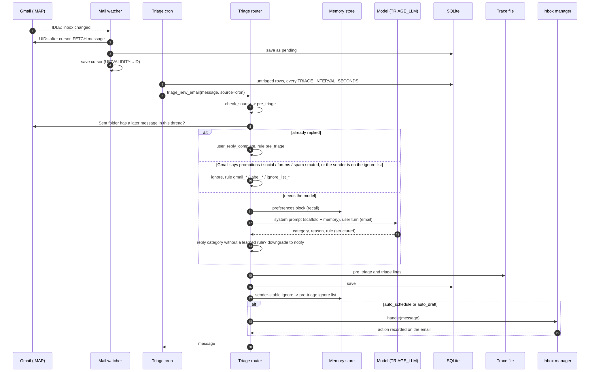
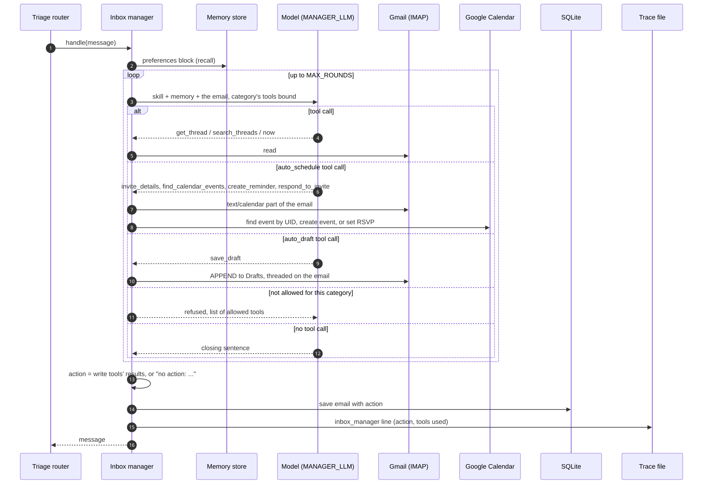
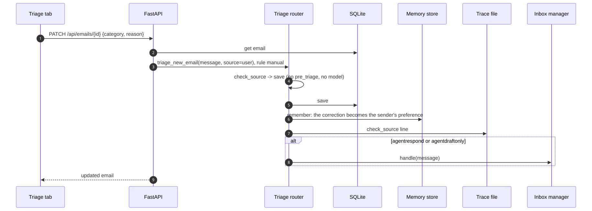
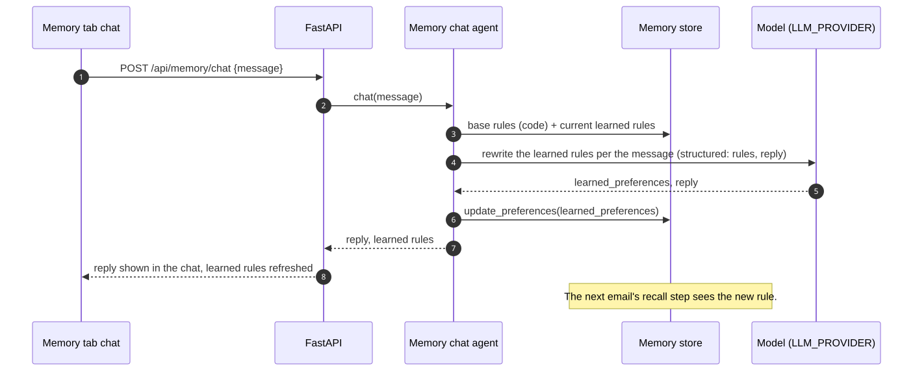
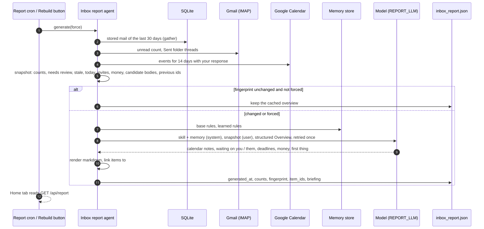
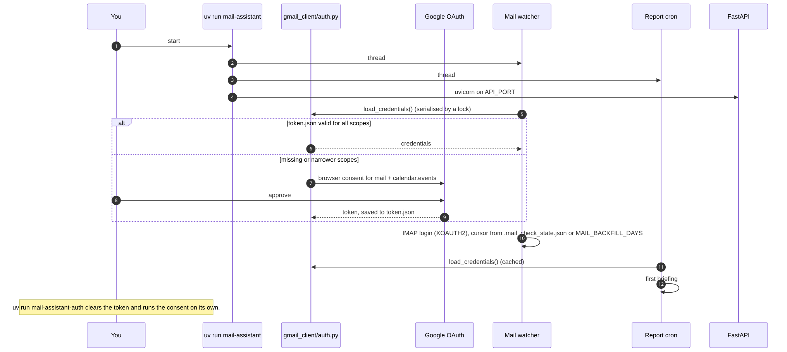

# Sequence diagrams

How the main flows move through the app. Names match the modules in [architecture.md](architecture.md).

## 1. A new email arrives

Source: [diagrams/seq-new-email.mmd](diagrams/seq-new-email.mmd)

## 2. The inbox manager acts

Source: [diagrams/seq-inbox-manager.mmd](diagrams/seq-inbox-manager.mmd)

## 3. Saving a category by hand in the Inbox tab

Source: [diagrams/seq-manual-save.mmd](diagrams/seq-manual-save.mmd)

## 4. Teaching a preference in the Memory tab

Source: [diagrams/seq-memory-chat.mmd](diagrams/seq-memory-chat.mmd)

## 5. Building the Quick Overview

Source: [diagrams/seq-briefing.mmd](diagrams/seq-briefing.mmd)

## 6. Startup and authentication

Source: [diagrams/seq-startup.mmd](diagrams/seq-startup.mmd)
