# State graphs

These are the three LangGraph `StateGraph`s in the app. The diagram sources in `diagrams/graph-*.mmd` were produced by
LangGraph itself (`compiled.get_graph().draw_mermaid()`) and rendered to the images below. After changing a graph, update
the matching `.mmd` file (the Graph tab in the UI always shows the live graph) and re-render with `docs/render_images.sh`.

Dashed edges are conditional edges chosen at run time. The Graph tab in the UI draws the same graphs from `GET /api/graph`.

## Email triage router

`agents/__email_triage_router_agent__.py`. Runs once per new email from the watcher, and once per category saved by
hand in the Triage tab (with `source = "user"`).

Source: [diagrams/graph-triage-router.mmd](diagrams/graph-triage-router.mmd)

### State

| Field | Type |
| --- | --- |
| `message` | `EmailMessage` |
| `source` | `Literal` |
| `preferences` | `str` |
| `learned_rules` | `dict` |
| `sender_memory` | `mail_assistant.models.__sender_preference_model__.SenderPreference | None` |

### Nodes

| Node | What it does | Model call |
| --- | --- | --- |
| `check_source` | A category set by hand in the UI skips everything and goes to `save`. | no |
| `pre_triage` | Already replied (a later message of yours in the thread) becomes `user_reply_complete`; Gmail Promotions, Social, Forums, Spam, muted, or one of your `PRE_TRIAGE_IGNORE_LABELS` becomes `ignore`. Either skips to `save`. | no |
| `recall` | Loads the preferences block (base rules from code plus learned rules) and the sender fact from long-term memory. | no |
| `triage` | Asks the configured model for category, reason, and the rule applied; downgrades a reply category that no learned rule supports to `notify`. On failure the email is stored `pending`. | yes |
| `save` | Writes the email to SQLite. | no |
| `remember` | Records the decision as the sender's latest preference (skipped for `pending`). | no |
| `inbox_manager` | For `agentrespond` and `agentdraftonly`, runs the inbox manager graph below. | via manager |

## Inbox manager

`agents/__inbox_manager_agent__.py`. Runs from the router's `inbox_manager` node. `manage` calls the model with only
the tools its category allows; each tool is its own node. At most 6 model calls.

Source: [diagrams/graph-inbox-manager.mmd](diagrams/graph-inbox-manager.mmd)

### Tools by category

| Category | Tools |
| --- | --- |
| `agentrespond` | `get_thread`, `search_threads`, `now`, `invite_details`, `find_calendar_events`, `create_reminder`, `respond_to_invite` |
| `agentdraftonly` | `get_thread`, `search_threads`, `now`, `save_draft` |

`unknown_tool` answers calls to tools that do not exist or are not allowed for the category; `repeat` answers a call
identical to an earlier one without running it again.

### State

| Field | Type |
| --- | --- |
| `messages` | `ForwardRef('Annotated[list[AnyMessage], add_messages]', module='langgraph.graph.message')` |
| `message` | `EmailMessage` |
| `memory` | `str` |
| `rounds` | `int` |
| `allowed` | `list` |

## Inbox report

`agents/__inbox_report_agent__.py`. Runs at startup, every `REPORT_INTERVAL_SECONDS`, and on Rebuild from the Home tab.
`report` calls the model with read-only mailbox tools; `insist` sends it back once if it wrote a briefing without opening
a thread. At most 8 model calls, then one more without tools if the answer is not prose.

Source: [diagrams/graph-inbox-report.mmd](diagrams/graph-inbox-report.mmd)

### State

| Field | Type |
| --- | --- |
| `messages` | `ForwardRef('Annotated[list[AnyMessage], add_messages]', module='langgraph.graph.message')` |
| `name` | `str` |
| `memory` | `str` |
| `counts` | `dict` |
| `rounds` | `int` |
